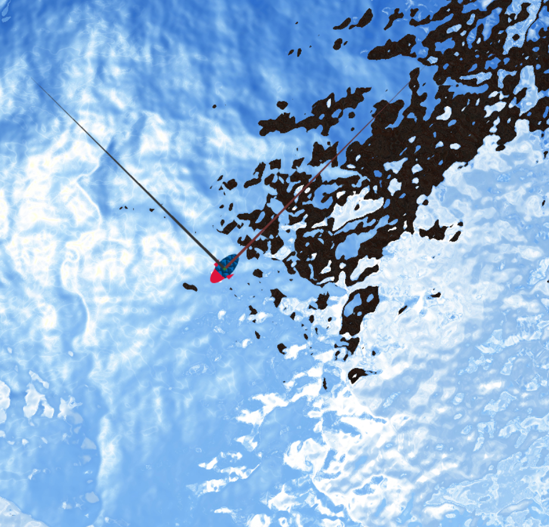
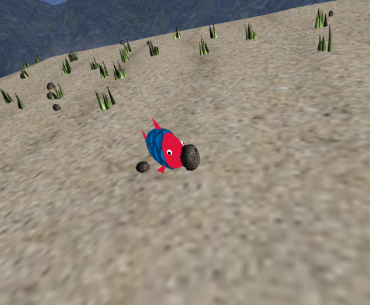
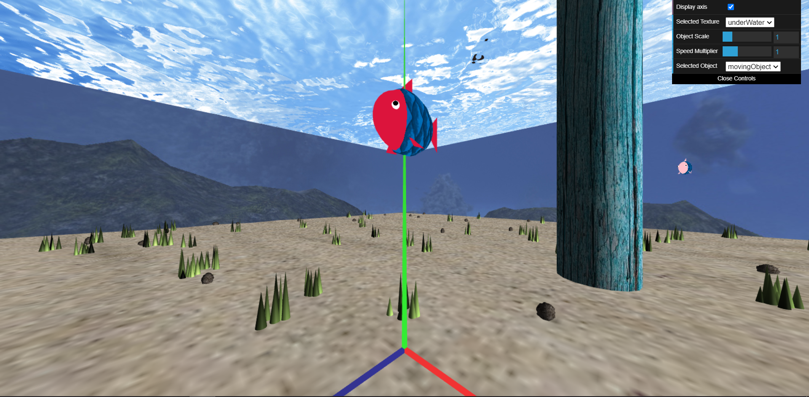

# CGRA 2020/2021

## Group T05G06
Emanuel José Pessoa Ribeiro - up201906375  
Joana Teixeira Mesquita - up201907878  

### Observações

- Para o peixe atirar as pedras é necessário precionar a tecla "t" à altura maxima e a uma distância máxima de 5 unidades do ninho.  
- Na interface é possivel mudar entre a parte A e a parte B do projeto atravez de um dropdown.
- O dropdown dos objetos só funciona na parte A do projeto.
- As imagens apresentadas a seguir foram tiradas quando foi completado o respetivo ponto, sendo que, ao fazer o resto do projeto, algumas coisas foram alteradas (exemplo: as cores das algas mudam até ao final do projeto como refletido nas imgens abaixo).
- Pontos extra a avaliar:
    - 7.1.  Algas (0.5 valores)
    - 7.4.  Lançamento das pedras para o alvo (1 valor)
    - 7.5.  MyAnimatedFish - Animação de outros peixes (1.5 valores)
- Outros pontos extra que ralizá-mos
    - 7.3.  Colocação das pedras no alvo (0.5 valores)

### 1 - MyFish

### 2 - MySeaFloor and nest

### 3 - WaterSurface 

### 4 - MyRockSet 

### 5 - MyPillarSet

### 6 - Overall aspect of the scene

### 7- MyMovingFish interacting with rocks and rock placement on nest

### 8 - Animated Fishes 

### 9 - Randomly generated algaes

### 10 - Rock thrown at nest

